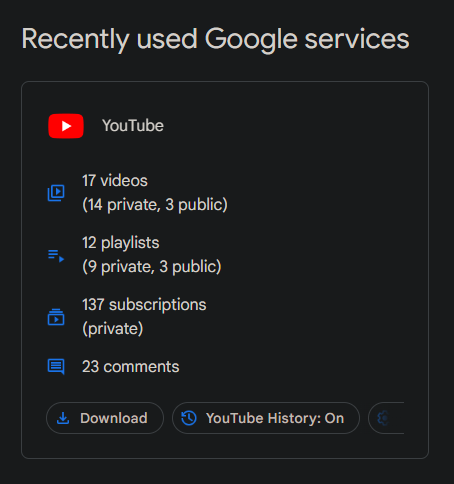
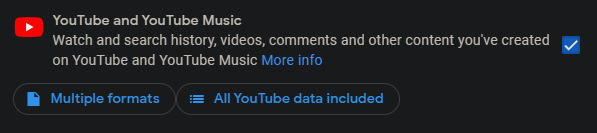
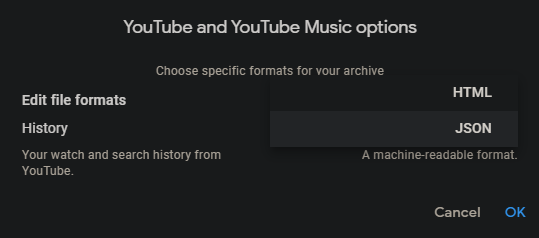
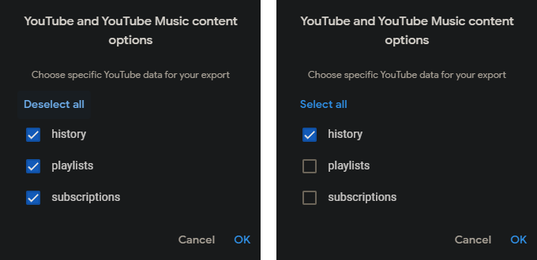
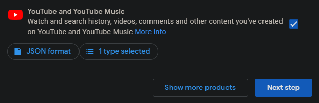

# YouTube History Viewer

## Usage

### Export your YouTube watch history

1. Visit [Google Dashboard](https://myaccount.google.com/dashboard).

2. Under "Recently used Google services", find "YouTube" and click "Download".

   

   This will take you to [Google Takeout](https://takeout.google.com/),
   with only your "YouTube and YouTube Music" data selected.

   

3. Click "Multiple formats", then find "History" and select "JSON" in the dropdown.

   

4. Click "All YouTube data included", then click "Deselect all", then select "history".

   

5. Click "Next step".

   

6. Choose file type, frequency & destination, then click "Create export".

7. When your export is done, you will have a compressed file containing your data.  
   Extract the data and find the `watch-history.json` under the `Takeout/YouTube and YouTube Music` directory.
